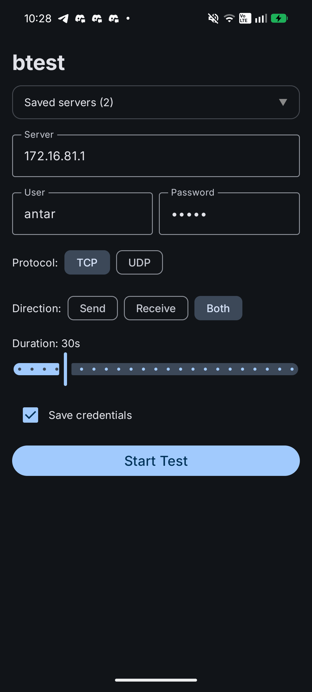
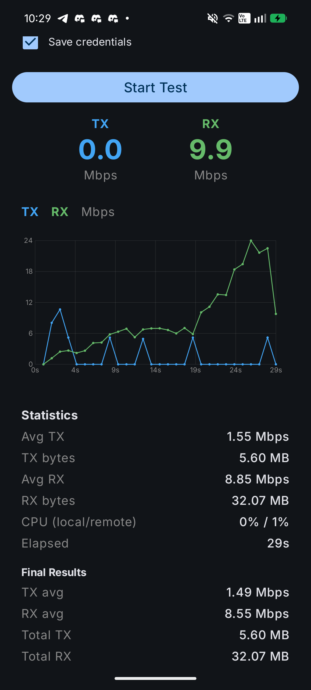
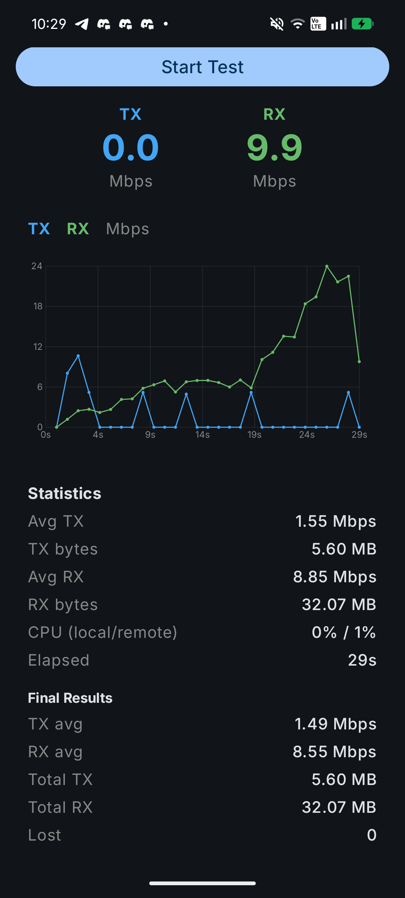

# btest-android

MikroTik Bandwidth Test (btest) client for Android — native Material3 UI wrapping the [btest-rs](https://github.com/manawenuz/btest-rs) CLI binary.

## Screenshots

| Config | Running | Results |
|--------|---------|---------|
|  |  |  |

## Features

- TCP and UDP bandwidth testing against MikroTik-compatible servers
- Bidirectional testing (send, receive, or both simultaneously)
- Real-time speed graph with TX/RX overlay
- Live CPU monitoring (local via `/proc/stat`, remote from server)
- Configurable duration (10–120 seconds)
- Material3 dark theme with dynamic colors (Android 12+)
- Single-screen UI — no navigation, no setup wizards

## Public Test Servers

| Location | Address | Dashboard |
|----------|---------|-----------|
| US | `104.225.217.60` | [btest.home.kg](https://btest.home.kg) |
| EU | `188.245.59.196` | [btest.mikata.ru](https://btest.mikata.ru) |

Default credentials: `btest` / `btest`

Limits: 2 GB daily, 120s max duration. Results viewable at `https://btest.home.kg/dashboard/YOUR_IP`.

## Requirements

- Android 7.0+ (API 24)
- `INTERNET` permission (no runtime permission needed)

## Install

Download the latest APK from [Releases](../../releases) and install on your device.

Or build from source:

```bash
# Clone
git clone https://github.com/manawenuz/btest-rs-android.git
cd btest-rs-android

# Download pre-built btest binaries
curl -L https://github.com/manawenuz/btest-rs/releases/latest/download/btest-android-aarch64.tar.gz | tar xz
mv btest app/src/main/jniLibs/arm64-v8a/libbtest.so

curl -L https://github.com/manawenuz/btest-rs/releases/latest/download/btest-android-armv7.tar.gz | tar xz
mv btest app/src/main/jniLibs/armeabi-v7a/libbtest.so

# Build
./gradlew assembleDebug

# Install
adb install app/build/outputs/apk/debug/app-debug.apk
```

## Usage

See [User Guide](docs/user-guide.md) for detailed instructions.

**Quick start:** Launch the app, leave defaults, tap **Start Test**. You'll see real-time TX/RX speeds, a live graph, and statistics.

## Architecture

See [docs/architecture.md](docs/architecture.md) for the full architecture overview.

The app wraps the `btest-rs` binary (pre-compiled for ARM64 and ARMv7) and runs it as a subprocess via `ProcessBuilder`. The binary handles all protocol logic — the app only provides the UI and parses stdout.

## License

MIT
