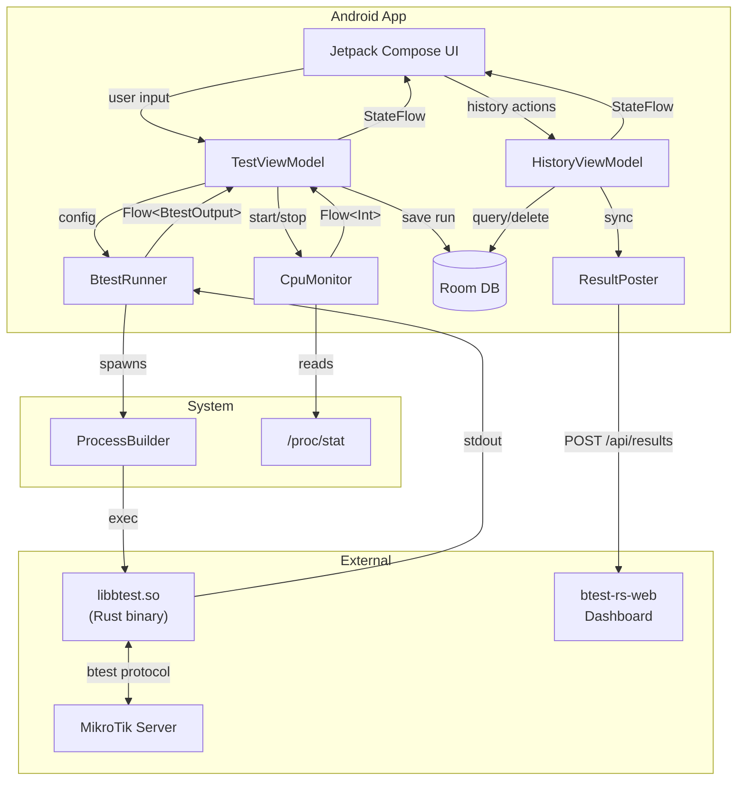
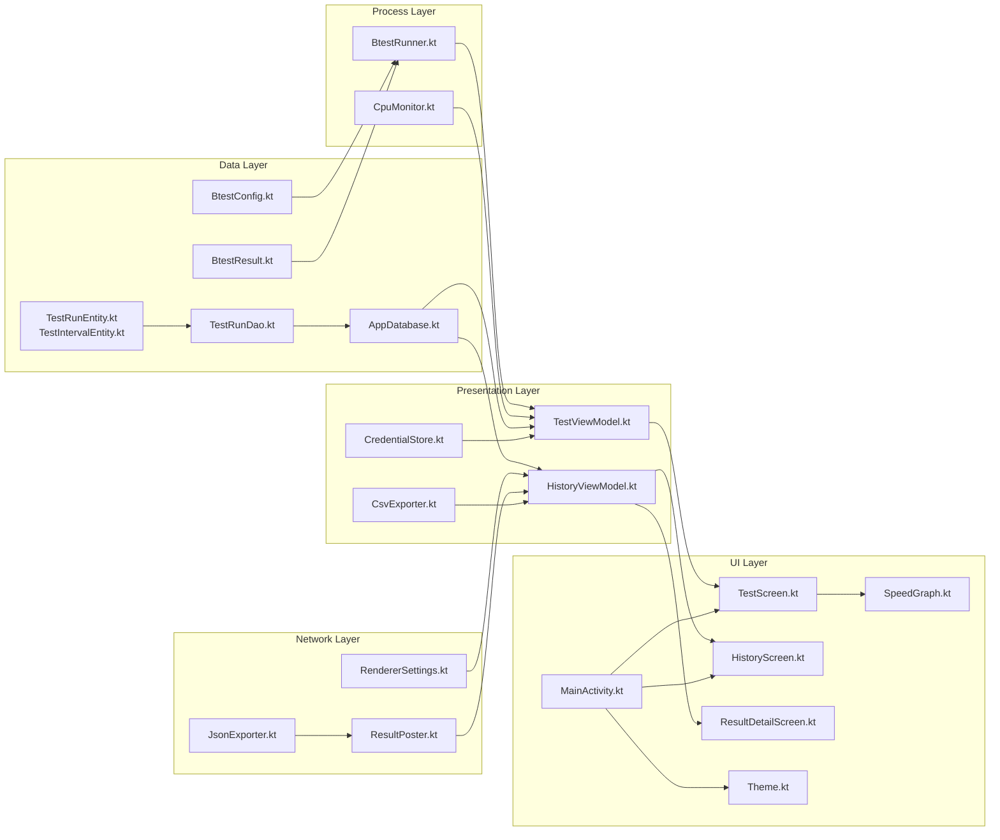
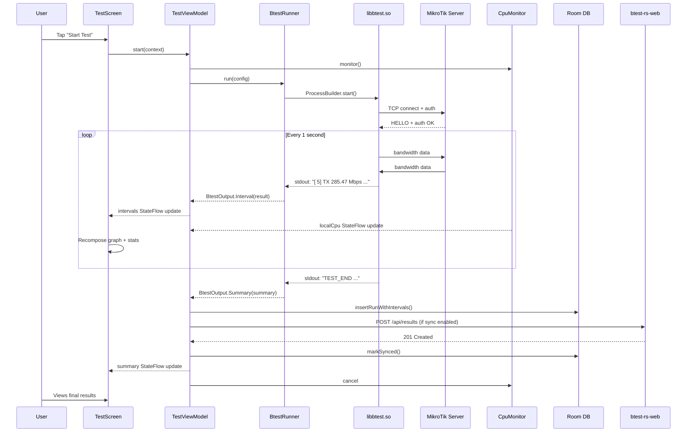
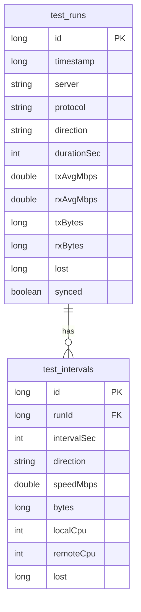
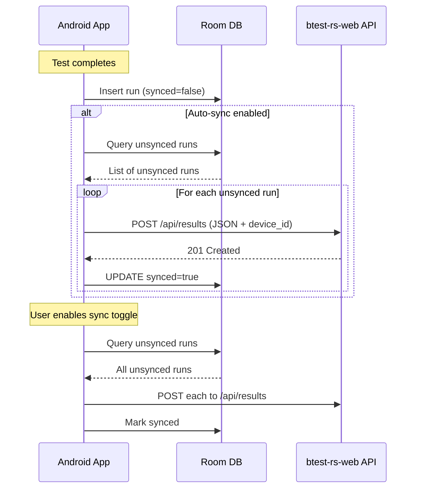
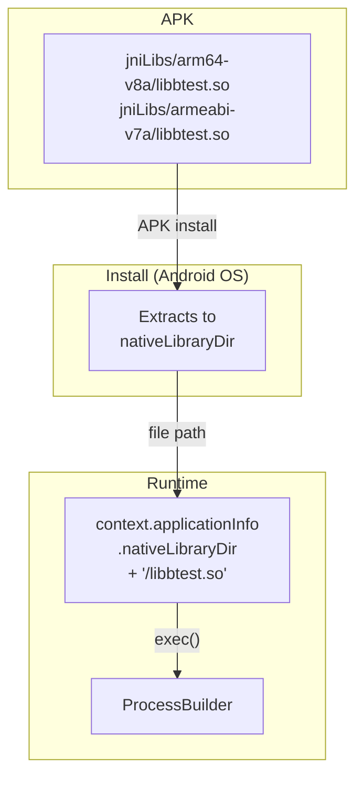
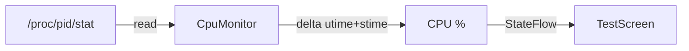
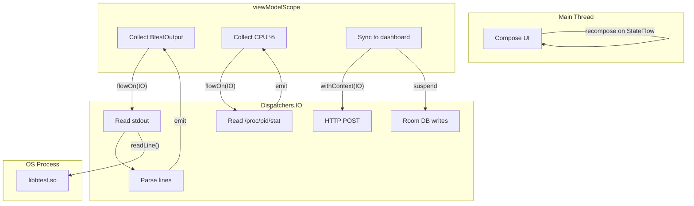

# Architecture

## Overview

btest-android is a native Android wrapper around the [btest-rs](https://github.com/manawenuz/btest-rs) CLI binary. The app does **not** implement the MikroTik bandwidth test protocol — it bundles the pre-compiled Rust binary and executes it as a subprocess, parsing its stdout for real-time results. Test results are persisted to a local Room database and optionally synced to a [btest-rs-web](https://btest-rs-web.vercel.app) dashboard.



## Module Structure



| File | Responsibility |
|------|---------------|
| `BtestConfig.kt` | Data class for test parameters; builds CLI argument list |
| `BtestResult.kt` | Data classes for per-interval stats and test summary |
| `BtestRunner.kt` | Spawns binary via `ProcessBuilder`, parses stdout line-by-line, emits `Flow<BtestOutput>` |
| `CpuMonitor.kt` | Reads `/proc/<pid>/stat` every 1s, computes process CPU %, emits `Flow<Int>` |
| `TestViewModel.kt` | Holds `StateFlow`s for test UI state; coordinates runner, CPU monitor, and auto-sync |
| `HistoryViewModel.kt` | Manages history list, selection, detail view, CSV export, and web dashboard sync |
| `CredentialStore.kt` | Persists server credentials to SharedPreferences |
| `RendererSettings.kt` | Persists web dashboard URL, API key, and sync toggle |
| `JsonExporter.kt` | Converts runs/intervals to JSON for API submission (single and batch) |
| `ResultPoster.kt` | HTTP POST to btest-rs-web API (`/api/results` and `/api/results/batch`) |
| `CsvExporter.kt` | Exports selected runs as CSV for sharing |
| `TestRunEntity.kt` | Room entity for test runs (includes `synced` flag) |
| `TestIntervalEntity.kt` | Room entity for per-second interval data |
| `TestRunDao.kt` | Room DAO with queries for CRUD, sync status, and batch operations |
| `AppDatabase.kt` | Room database singleton with migrations |
| `MainActivity.kt` | Single-activity entry point with navigation drawer (Test / History) |
| `TestScreen.kt` | Config form, start/stop, live speed display, graph, statistics |
| `HistoryScreen.kt` | Run list with selection, action bar, web dashboard settings card |
| `ResultDetailScreen.kt` | Detailed view of a saved run with graph and full statistics |
| `SpeedGraph.kt` | Canvas-based real-time line chart (TX blue, RX green) |
| `Theme.kt` | Material3 dark color scheme with dynamic colors on Android 12+ |

## Data Flow



## Persistence Layer

Test results are stored in a Room database (`btest_history.db`) with two tables:



The `synced` column tracks whether each run has been uploaded to the web dashboard, ensuring each run is only uploaded once.

## Web Dashboard Sync



- **Single runs**: `POST /api/results` with JSON body
- **Batch sync**: Each run POSTed individually to avoid partial failures
- **Deduplication**: The `synced` flag prevents re-uploading
- **Device ID**: `ANDROID_ID` is included in every payload for device-level grouping on the dashboard
- **Verify**: `GET /api/auth/me` validates the API key before enabling sync

## Binary Integration

The `btest-rs` binary is bundled as a native library to leverage Android's built-in extraction:



Key details:

- Named `libbtest.so` (not `btest`) because Android only extracts `lib*.so` files from `jniLibs/`
- `extractNativeLibs="true"` and `useLegacyPackaging=true` ensure the binary is extracted to disk (required for `exec()`)
- The binary is a statically-linked PIE executable with Android's `/system/bin/linker64` as interpreter
- Dependencies: only `libc.so`, `libm.so`, `libdl.so` (all present on every Android device)

## Output Parsing

BtestRunner parses two output formats from stdout:

### Interval lines

```
[   5]  TX  285.47 Mbps (35684352 bytes)  cpu: 20%/62%
[   5]  RX  283.64 Mbps (35454988 bytes)  cpu: 20%/62%  lost: 12
```

Regex: `\[\s*(\d+)]\s+(TX|RX)\s+([\d.]+)\s+(Gbps|Mbps|Kbps|bps)\s+\((\d+) bytes\)(?:\s+cpu:\s+(\d+)%/(\d+)%)?(?:\s+lost:\s+(\d+))?`

### Summary line

```
TEST_END peer=... proto=TCP dir=both duration=60s tx_avg=284.94Mbps rx_avg=272.83Mbps tx_bytes=2137030656 rx_bytes=2046260728 lost=0
```

### CPU Monitoring

The binary's built-in CPU sampler does not work reliably on Android (always reports 0% for local CPU). The app implements its own `CpuMonitor` that reads `/proc/<pid>/stat` for the btest process:



## Threading Model



- **No JNI/NDK** — the binary runs as a separate OS process
- **No mutexes** — all state flows through Kotlin `StateFlow` (thread-safe)
- Process lifecycle tied to ViewModel: `stop()` calls `Process.destroyForcibly()`
- ViewModel's `onCleared()` ensures cleanup on activity destruction
- Network I/O (sync) runs on `Dispatchers.IO`, never blocks the main thread
